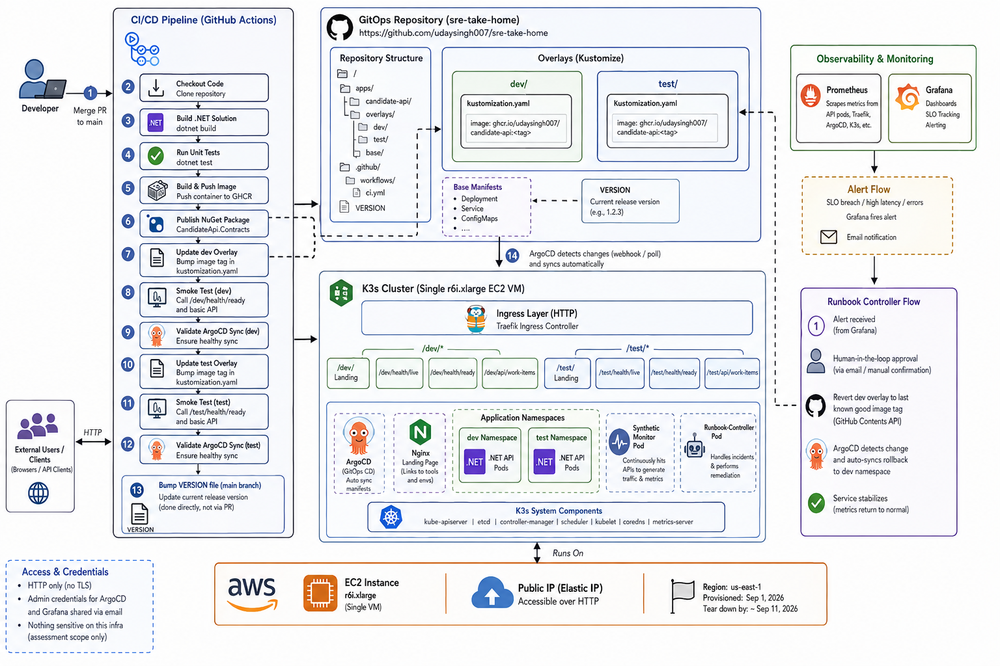
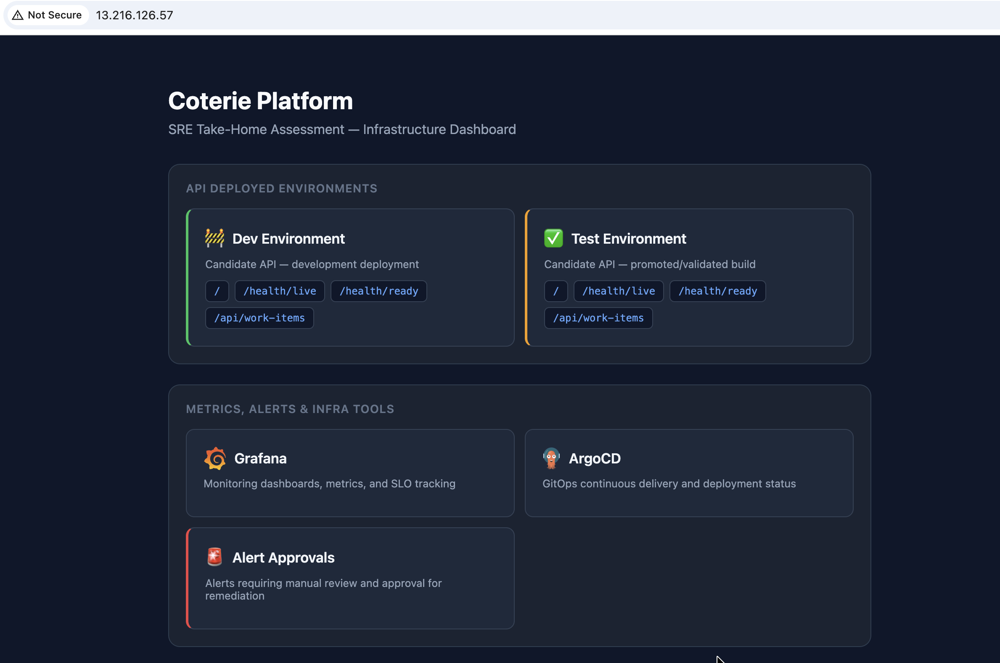
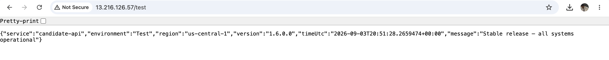
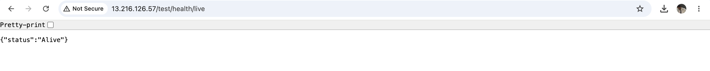
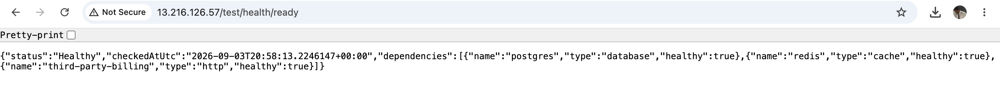
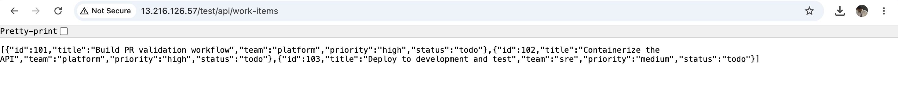
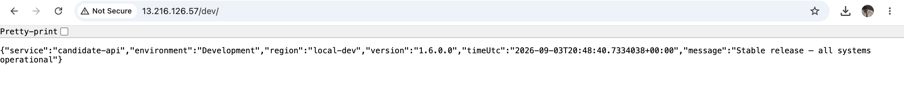
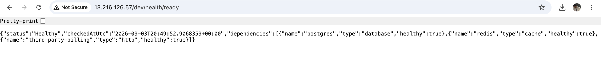

# SRE Take-Home Assessment

## How to Run and Access the Demo

### Getting Oriented

1. Visit the landing page at `http://13.216.126.57/` for a bird's-eye view of all API endpoints, observability tools (Grafana, ArgoCD), and infrastructure links.

### Happy Path — Deploying a New Version

2. Create a PR that changes `trigger-demo.txt` in the repo root (the content doesn't matter — this file exists solely to trigger the pipeline without touching application code).
3. Merge the PR to `main`. This triggers the GitHub Actions deploy workflow.
4. The workflow builds the .NET solution, runs tests, pushes the image to GHCR, deploys to `dev`, runs a smoke test, validates via ArgoCD, and then promotes to `test`.
5. Once the workflow completes successfully (unless the demo gods are angry), click the DEV and TEST endpoint links on the landing page — you should see the version number bumped up.

### Unhappy Path — Incident Response & Automated Rollback

6. To simulate a bad deployment, uncomment the chaos/fault-injection lines (29–31) in `src/CandidateApi/Program.cs`, commit, and merge to `main`.
7. The deploy will succeed normally — the API works fine for the first 5 minutes after startup.
8. After 5 minutes, the `/api/work-items` endpoint begins returning 500 errors, which the synthetic monitor detects.
9. Prometheus SLO recording rules detect the availability drop, and Grafana fires an alert — sending an email notification and triggering the runbook-controller.
10. Visit the runbook approval page (linked from the landing page under "Alert Approvals") to review the pending rollback.
11. Once you approve, the runbook-controller reverts the `dev` Kustomize manifest to the last stable image tag via the GitHub Contents API, and ArgoCD automatically rolls back the deployment.
12. The API recovers without any manual kubectl intervention — the entire remediation flows through Git.

## Solution Summary

All actions are triggered when a developer merges a PR to the `main` branch. The GitHub Actions workflow clones the repo, builds the .NET solution, runs unit tests, pushes the container image to GHCR, and publishes the `CandidateApi.Contracts` NuGet package as a build artifact. It then updates the Kustomize image tag in the `dev` overlay manifest, runs a smoke test against the dev endpoint, and validates a healthy sync via ArgoCD before promoting to `test` by updating its manifest in the same way. A `VERSION` file in the `main` branch tracks the current release version and is bumped directly (not via PR) to avoid recursive workflow triggers.

ArgoCD, running on the K3s cluster, detects the manifest changes in this repo and automatically deploys the updated image to the corresponding Kubernetes namespace (`dev` or `test`). Prometheus scrapes metrics from the API pods, and Grafana provides dashboards, SLO tracking, and alerting on top of those metrics. A synthetic monitor pod continuously hits the API endpoints to generate realistic traffic patterns for response time and request rate metrics.

When a deployment goes bad — for example, response times degrade beyond the SLO threshold — Grafana fires an alert and sends an email notification. The alert also triggers a dedicated runbook-controller pod running in the cluster, which requires human-in-the-loop approval before executing remediation. Once approved, the runbook-controller uses the GitHub Contents API to revert the `dev` overlay manifest back to the last known stable image tag, and ArgoCD picks up the rollback automatically.

All API endpoints across both environments (`/dev/`, `/dev/health/live`, `/dev/health/ready`, `/dev/api/work-items`, and the same under `/test/`) are exposed via Traefik ingress routes on the K3s cluster. Access is over HTTP by design — TLS/certificate management is not the focus of this assessment and would add unnecessary complexity. Admin credentials for Grafana and ArgoCD are shared via email; there is nothing sensitive on this infrastructure, though in a corporate environment this would obviously be hardened.

I believe this submission covers the core SRE assessment requirements, along with the senior extensions: **Observability & SLOs** (Prometheus + Grafana dashboards + SLO burn-rate alerting), **Incident Response** (automated runbook with human approval for rollback), and **Infrastructure as Code** (AWS infra provisioned via Terraform in the companion [iac-for-coterie](https://github.com/udaysingh007/iac-for-coterie) repo). I aimed to spend around 6 hours but ended up closer to 8–9 hours given the breadth of what needed to come together. Given the time constraints, there may be rough edges, but the solution should serve as a reasonable demonstration of my abilities in this space. I leveraged AI tooling during development, and even with that assistance, getting all these pieces integrated and working within that timeframe was a significant undertaking. Happy to address any questions or discuss the decisions made along the way.

## TL;DR

- **CI/CD flow**: PR merge to main triggers build, test, GHCR push, NuGet artifact, dev deploy, smoke test, ArgoCD validation, then test promotion
- **Version management**: VERSION file bumped directly on main to avoid recursive workflow triggers
- **GitOps delivery**: ArgoCD detects manifest changes in this repo and auto-deploys to the K3s cluster
- **Observability**: Prometheus + Grafana dashboards + SLO burn-rate alerting
- **Synthetic monitoring**: dedicated pod generating realistic traffic and metrics against API endpoints
- **Incident response**: Grafana alert → email + runbook-controller → human approval → GitHub API manifest revert → ArgoCD auto-rollback
- **Ingress**: Traefik routes for all API endpoints across dev and test namespaces
- **Security posture**: HTTP by design for simplicity; credentials shared via email — would be hardened in a corporate environment
- **Assessment coverage**: core SRE + Observability/SLOs + Incident Response + IaC (via [iac-for-coterie](https://github.com/udaysingh007/iac-for-coterie))

## Screenshots

### Architecture

### Landing Page

---

<strong>TEST Environment Endpoints</strong>

#### /test — Service Metadata

#### /test/health/live — Liveness

#### /test/health/ready — Readiness

#### /test/api/work-items — Work Items

---

<strong>DEV Environment Endpoints</strong>

#### /dev — Service Metadata

#### /dev/health/live — Liveness

#### /dev/health/ready — Readiness

#### /dev/api/work-items — Work Items

---
